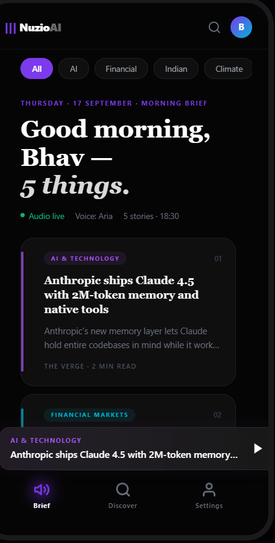
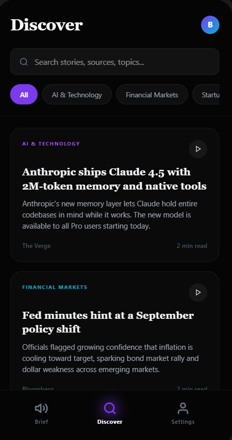
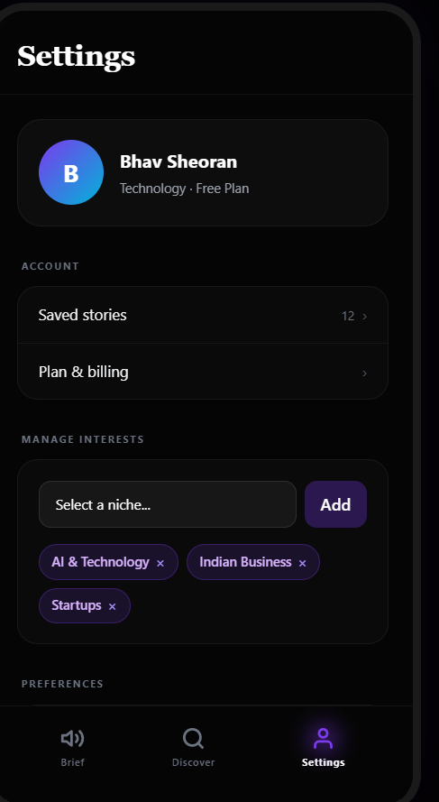

# Nuzio AI 🎧

Nuzio AI is a personalized audio news platform tailored for modern professionals. It curates a daily "Morning Brief" of news specific to your interests and profession, transforming text articles into high-quality, listenable audio summaries. 

With a beautiful, fluid UI powered by Framer Motion and a robust backend integrated with Supabase, Nuzio AI delivers a premium, native-app-like experience right in your browser.

## Screenshots

<div align="center">
  
  
  
  
</div>

## Features
- **Personalized Audio Briefings**: Get daily customized news based on your selected niches (e.g. AI & Tech, Startups, Financial Markets).
- **Google Authentication**: Seamless secure login and onboarding flow.
- **Collapsible Mini-Player**: A persistent, physics-based fluid audio player that stays with you across the application.
- **Discover Page**: Explore other news stories, filter by categories, and listen on the go.
- **Interest Sync**: Preferences and interests sync in real-time across your account using Supabase.
- **Sleek UI/UX**: Dark mode by default, glassmorphism elements, premium gradients, and fluid page transitions.

## Tech Stack
- **Frontend**: React, Vite, Framer Motion, React Router DOM, Tailwind CSS (Custom Tokens)
- **Backend**: Node.js, Express
- **Database / Auth**: Supabase (PostgreSQL)

## Project Structure
This is a monorepo containing both the frontend and backend applications.
- `/frontend`: The React application.
- `/backend`: The Express server.

## Getting Started

### Prerequisites
- Node.js (v18+)
- A Supabase Project (with Google Auth enabled)

### Setup

1. **Clone the repository**
   ```bash
   git clone https://github.com/Bhavishya-28/Assignement.git
   cd Assignement
   ```

2. **Install dependencies**
   Install dependencies for the root, frontend, and backend:
   ```bash
   npm install
   cd frontend && npm install
   cd ../backend && npm install
   ```

3. **Environment Variables**
   Create a `.env` file in the root directory and the frontend directory with your Supabase credentials:
   ```env
   VITE_SUPABASE_URL=your_supabase_url
   VITE_SUPABASE_ANON_KEY=your_supabase_anon_key
   ```

4. **Run the Application**
   From the root directory, you can start both the frontend and backend concurrently:
   ```bash
   npm run dev
   ```

## License
MIT License
